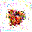
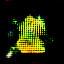

# GANs

This is a collection of implementations of different types of GANs in Keras. Below, you can find a breakdown of which GANs have been implemented and how to run them.

You'll find so far:

- [Original GAN](models/gan.py)
- [DCGAN](models/dcgan.py)

## Original GAN - [https://arxiv.org/pdf/1406.2661.pdf](https://arxiv.org/pdf/1406.2661.pdf)
```buildoutcfg
usage: gan.py [-h] [--epochs EPOCHS] [--batch_size BATCH_SIZE]
              [--batch_per_epoch BATCH_PER_EPOCH] [--noise_dim NOISE_DIM]
```

- --epochs - The number of epochs to train for (400 by default)
- --batch_size - The standard batch size (128 by default)
- --batch_per_epoch - The number of batches to train on per epoch
- --noise_dim - The size of the noise vector (100 by default)

Result from GAN:


## DCGAN - [https://arxiv.org/pdf/1511.06434.pdf](https://arxiv.org/pdf/1511.06434.pdf)
```buildoutcfg
usage: dcgan.py [-h] [--epochs EPOCHS] [--batch_size BATCH_SIZE]
                [--batch_per_epoch BATCH_PER_EPOCH] [--noise_dim NOISE_DIM]
                [--dataset DATASET] [--load_model LOAD_MODEL] [--latent]

```

- --epochs - The number of epochs to train for (400 by default)
- --batch_size - The standard batch size (128 by default)
- --batch_per_epoch - The number of batches to train on per epoch
- --noise_dim - The size of the noise vector (100 by default)
- --dataset - The name of the data set
- --load_model - If loading a model for the latent space interpolation, the path to the model's weights
- --latent - The flag for interpolating over the latent space


Result from DCGAN on original 151 Pokemon:




Result from DCGAN on generation 5 Pokemon:




