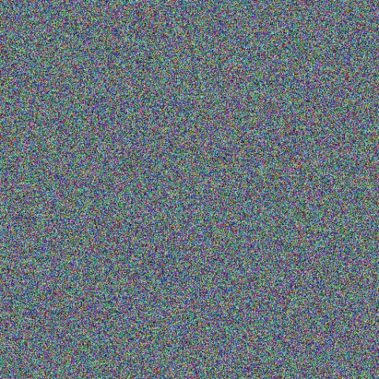

# Style Transfer 

This is an implementation of the style transfer algorithm in Keras. It is synthesis of the original paper and a 
normalization technique as outlined in the below resources.



## Using the File
```
usage: style-transfer.py [-h] [--iter ITER] [--content_weight CONTENT_WEIGHT]
                         [--style_weight STYLE_WEIGHT]
                         [--var_weight VAR_WEIGHT] [--height HEIGHT]
                         [--width WIDTH]
                         content style res_prefix
 ```

- --iter - The number of iterations (10 by default)
- --content_weight - The weight given to content loss (0.025 by default)
- --style_weight - The weight given to style loss (1.0 by default)
- --var_weight - The weight given to the total variation loss (1.0 by default)
- --height - The height of the images being used
- --width - The width of the images being used
- content - Path to the content target image
- style - Path to the style target image
- res_prefix - Prefix of the generated image

```buildoutcfg
python style-transfer.py images/content.png images/style.png images/output
```

## References

 - https://arxiv.org/pdf/1508.06576.pdf (original style loss paper)
 - https://arxiv.org/pdf/1412.0035.pdf (explains the ideas behind variation loss)
 - https://github.com/keras-team/keras/blob/master/examples/neural_style_transfer.py (style transfer as given by the keras team)
 - https://harishnarayanan.org/writing/artistic-style-transfer/ (longer tutorial that walks through convolutions)